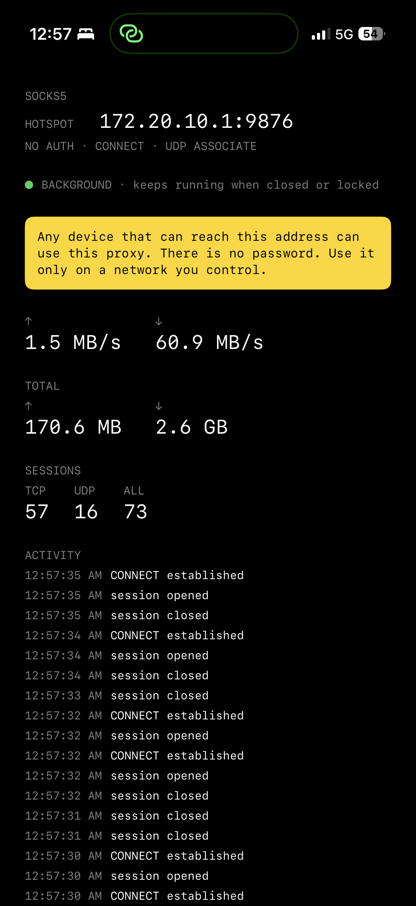

# iOS SOCKS5 Server

A SOCKS5 proxy server that runs on your iPhone, so other devices on the same
network can route traffic through it.

## Why this exists

When you tether a laptop to your phone, the laptop's packets are *forwarded* by
the phone. They reach the carrier carrying the laptop's TCP/IP fingerprint and a
TTL one hop lower than anything the phone sends itself. That difference is what
tethering detection looks for.

This proxy removes it. The laptop speaks SOCKS5 to the phone, and the phone
opens its own connection to the destination — so the packets that leave the
radio are originated by the phone's own IP stack and look like traffic the phone
generated.

**This only makes sense over the phone's own hotspot.** Pointing a client at the
proxy across ordinary Wi-Fi achieves nothing — that client already has the
network's own uplink — and it leaves a passwordless gateway listening on a
network you do not control.

> ### ⚠️ There is no password
>
> The proxy accepts **NO AUTH** connections. Anyone who can reach your phone's
> address and port can use it as an open relay — including anything else on the
> café Wi-Fi, the hotel LAN, or a VPN that puts your devices on one flat
> network. Run it only on a network you control, and stop the app when you are
> done. The app shows the same warning on screen and it is not dismissible.

## Features

- **SOCKS5**: NO AUTH, `CONNECT`, and `UDP ASSOCIATE`
- **Addressing**: IPv4, IPv6, and domain names (ATYP `0x01` / `0x04` / `0x03`)
- **Traffic monitoring**: live upload/download rate, cumulative totals, active
  TCP/UDP session counts, and a recent-activity log
- **Reachable addresses**: every interface a client could connect to, hotspot
  first, refreshed as you switch networks
- **Keeps serving in the background** — see the caveats below
- Written in Swift on Network.framework; no C proxy is linked into the app

## Requirements

- iOS 17.0 or later
- Xcode with a signing account (a free Apple ID works)

## Screenshot

<p align="center">
    
</p>

## Installation

1. Clone the project:
```bash
git clone https://github.com/Nanako0129/SocksBypass.git
```

2. Open the Xcode project:
- Open `SocksBypass.xcodeproj`
- Select your developer account for signing
- Change the Bundle Identifier to your own

3. Deploy to a device:
- Connect your iOS device
- Select it in Xcode
- Run

## Usage

1. Launch the app
2. Wait for the IP address and port to appear (default port 9876)
3. On the device that should use the proxy, configure SOCKS5:
   - Proxy server: the displayed IP address
   - Port: the displayed port
   - No authentication

For USB instead of Wi-Fi, use [danielpaulus/go-ios](https://github.com/danielpaulus/go-ios)
forward mode: `ios forward 1080 9876`, then point the client at `127.0.0.1`.

## Running in the background

The app keeps serving after you switch away or the screen locks. It does that by
holding an active audio session that plays silence, which is why it declares the
`audio` background mode.

This is a workaround, not a sanctioned mechanism. iOS offers no supported way for
an ordinary app to keep an inbound listener alive: `BGTaskScheduler` only grants
short opportunistic wake-ups, `beginBackgroundTask` only buys seconds to finish
work in flight, and Network Extension — the one API designed for networking that
outlives its app — exists to tunnel *this* device's traffic outward, not to serve
LAN peers connecting in. Apple's audio background mode is meant for apps whose
purpose is playing audio, and App Review rejects this use of it. That is one more
reason this app is not App Store material.

What it costs you: the app stays scheduled continuously, so it draws power the
whole time it is running. Quit it when you are done. The audio session is
configured to mix with others, so it never interrupts whatever you are actually
listening to, and the samples are silent.

The main screen shows whether the keep-alive is actually in effect. If it reads
`FOREGROUND ONLY`, the app will stop serving as soon as it leaves the screen.

## Known limitation

If a client half-closes its write side (`shutdown(SHUT_WR)`) while a large
response is still arriving, the tail of that response can be lost. The cause is
Network.framework: once a half-closed connection finishes closing, bytes still
sitting in the receive buffer are discarded, and the framework exposes no option
to drain them. BSD sockets do not behave this way, which has been confirmed on
device.

The relay never reports this as success — a truncated stream is aborted with a
reset rather than a clean end-of-stream, so the client sees a connection error
instead of a short file that looks complete. Ordinary HTTP clients and browsers
do not half-close mid-response and are not affected.

## Notes

- The client and the phone must be able to reach each other: same Wi-Fi network,
  personal hotspot, or USB
- Not suitable for App Store distribution

## Development

- `Bench/socks_bench.py` is the protocol and throughput harness. `--mode
  self-test` runs everything against a local proxy with no device involved.
- The `Benchmark` build configuration links a vendored
  [hev-socks5-server](https://github.com/heiher/hev-socks5-server) build, used
  only to compare engines. The shipping app does not include it. Licences for
  the vendored code are in `ThirdPartyNotices/`.
- **The Benchmark configuration does not build on a clean checkout.** `Vendor/`
  is gitignored and no XCFramework is committed, so run
  `scripts/build-hev-xcframework.sh` first or the link step fails. Debug and
  Release need nothing extra — they exclude the bridge entirely.

## License

This project is licensed under MIT License - see [LICENSE](LICENSE) file

## Acknowledgments

This project is a fork of [nneonneo/socks5-ios](https://github.com/nneonneo/socks5-ios).
Special thanks to Robert Xiao (nneonneo) for the original implementation, which
was based on [rofl0r/microsocks](https://github.com/rofl0r/microsocks). The
SOCKS5 core has since been rewritten in Swift and no longer contains microsocks.

---

# iOS SOCKS5 Server

一個跑在 iPhone 上的 SOCKS5 代理伺服器，讓同一個網路裡的其他裝置可以透過它連線。

## 這個專案在解什麼

用筆電連手機的個人熱點時，筆電送出的封包是被手機**轉發**出去的：它們抵達電信商時
帶著筆電自己的 TCP/IP 指紋，而且 TTL 比手機自己發的流量少一跳。分享偵測看的就是
這個差異。

這個代理把差異消掉。筆電對手機講 SOCKS5，由手機自己對目的地開連線——離開基地台的
封包因此是手機自己的 IP stack 產生的，看起來就是手機自身的流量。

**這只在手機自己的熱點上才有意義。** 讓客戶端透過一般 Wi-Fi 連這個代理沒有任何作
用——那台客戶端本來就有該網路的上行——而且會把一個沒有密碼的閘道留在你不掌控的網
段上。

> ### ⚠️ 沒有密碼
>
> 這個代理接受 **NO AUTH** 連線。任何能連到你手機位址與連接埠的人都能把它當
> 開放中繼使用——包括咖啡廳 Wi-Fi、旅館區網，或是把你的裝置放進同一個扁平網路
> 的 VPN 上的任何東西。只在你自己掌控的網路上使用，用完就把 app 關掉。app 內
> 也有同樣的警告，且無法關閉。

## 功能

- **SOCKS5**：NO AUTH、`CONNECT`、`UDP ASSOCIATE`
- **位址型別**：IPv4、IPv6、網域名稱（ATYP `0x01` / `0x04` / `0x03`）
- **流量監控**：即時上傳/下載速率、累計流量、TCP/UDP 連線數、近期活動記錄
- **可連位址**：列出所有客戶端可連的介面位址，熱點優先，切換網路時即時更新
- **背景持續服務** —— 注意事項見下方
- 以 Swift 搭配 Network.framework 實作，app 內不再連結任何 C 代理程式

## 需求

- iOS 17.0 以上
- Xcode 與一個簽署帳號（免費 Apple ID 即可）

## 截圖

<p align="center">
    
</p>

## 安裝說明

1. Clone 專案：
```bash
git clone https://github.com/Nanako0129/SocksBypass.git
```

2. 開啟 Xcode 專案：
- 打開 `SocksBypass.xcodeproj`
- 選擇你的開發者帳號進行簽署
- 修改 Bundle Identifier 為你自己的識別碼

3. 部署到裝置：
- 將 iOS 裝置連接到電腦
- 在 Xcode 中選擇你的裝置
- 執行

## 使用方法

1. 啟動應用程式
2. 等待顯示 IP 位址和連接埠（預設為 9876）
3. 在需要使用代理的裝置上設定 SOCKS5：
   - 代理伺服器：顯示的 IP 位址
   - 連接埠：顯示的連接埠
   - 不需要認證

如果想用 USB 而非 Wi-Fi，可以使用 [danielpaulus/go-ios](https://github.com/danielpaulus/go-ios)
的轉發模式：`ios forward 1080 9876`，用戶端指向 `127.0.0.1`。

## 背景運作

切換到其他 app 或鎖屏之後，代理仍會繼續服務。做法是持續持有一個播放靜音的音訊
工作階段，這也是它宣告 `audio` 背景模式的原因。

這是變通手法，不是被認可的機制。iOS 沒有提供任何受支援的途徑讓一般 app 維持入站
監聽：`BGTaskScheduler` 只給系統排定的短暫喚醒，`beginBackgroundTask` 只換到幾秒
用來收尾，而 Network Extension——唯一為「網路行為活過 app」設計的 API——是用來把
**本機**流量導出去的，不是對區網提供入站服務。Apple 的 audio 背景模式本意是給功能
本身就是播放音訊的 app，App Review 會擋下這種用法。這也是本專案不適合上架的原因
之一。

代價：app 會持續被排程，執行期間一直耗電，用完請關掉。音訊工作階段設定為與其他
來源混音，所以不會打斷你正在聽的東西，取樣本身也是靜音。

主畫面會顯示保活是否真的生效。如果顯示 `FOREGROUND ONLY`，代表 app 一離開畫面就
會停止服務。

## 已知限制

如果用戶端在大型回應還在傳輸時關閉了自己的寫入端（`shutdown(SHUT_WR)`），該回應
的尾端可能遺失。原因在 Network.framework：半關閉的連線一旦走完關閉流程，還留在
接收緩衝區裡的資料就會被丟棄，而框架沒有提供排空的選項。BSD socket 沒有這個行為，
這一點已在裝置上驗證。

relay 不會把這種情況當成成功——被截斷的串流會以 reset 中止，而不是送出乾淨的
結束訊號，所以用戶端看到的是連線錯誤，而不是一個看起來完整的短檔案。一般的 HTTP
用戶端與瀏覽器不會在回應中途半關閉，不受影響。

## 注意事項

- 用戶端與手機必須能互相連通：同一個 Wi-Fi 網路、個人熱點，或 USB
- 不適合透過 App Store 發布

## 開發

- `Bench/socks_bench.py` 是協定與吞吐量測試工具。`--mode self-test` 完全在本機
  對一個本地代理執行，不需要裝置。
- `Benchmark` 建置組態會連結一份 vendored 的
  [hev-socks5-server](https://github.com/heiher/hev-socks5-server)，僅用於引擎
  比較，正式 app 不包含它。vendored 程式碼的授權條款放在 `ThirdPartyNotices/`。

## 授權

此專案使用 MIT 授權條款 - 詳見 [LICENSE](LICENSE) 檔案

## 致謝

本專案修改自 [nneonneo/socks5-ios](https://github.com/nneonneo/socks5-ios)，特別
感謝 Robert Xiao (nneonneo) 開發的原始版本，該版本基於
[rofl0r/microsocks](https://github.com/rofl0r/microsocks)。SOCKS5 核心其後已改以
Swift 重寫，不再包含 microsocks。
